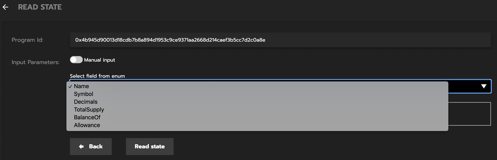

# Gear 合约揭秘

Gearfans 举办了 3 次 Gear workshop，从第一次的 [ping-pong](https://wiki.gear-tech.io/zh-cn/developing-contracts/examples/ping/) 合约，到 [去中心化 twitter](https://wiki.gear-tech.io/zh-cn/developing-contracts/examples/feeds)，再到 [Erc20](https://wiki.gear-tech.io/zh-cn/developing-contracts/examples/erc20) 。

那我们来介绍下 Gear 合约的基本结构。

## Gear 合约最小必要结构

```rust
#[no_mangle]
pub unsafe extern "C" fn init() {}

#[no_mangle]
pub unsafe extern "C" fn handle() {}
```

这 2 个方法是 Gear 合约的最小必要结构。`init()` 函数在合约初始化时执行一次。`handle()` 函数负责处理所有由我们程序处理的传入消息。

**小知识点**：
`#[no_mangle]` 表示禁止 Rust 编译器修改方法的名字，简单来讲 Rust 函数能在其它语言中被调用，必须禁用编译器的名称修改功能。

回到 ping-pong 合约，代码如下：

```rust
#![no_std]

use gstd::{msg, prelude::*};

#[no_mangle]
pub unsafe extern "C" fn handle() {
    let new_msg = String::from_utf8(msg::load_bytes()).expect("Invalid message");

    if new_msg == "PING" {
        msg::reply_bytes("PONG", 12_000_000, 0);
    }
}

#[no_mangle]
pub unsafe extern "C" fn init() {}
```

我们只处理了 `handle()` 了，`init()` 可以不做任何处理。`handle()` 的逻辑是：得到新消息 `new_msg`，
如果 new_msg 是 PING，通过 `msg::reply_bytes` 发送 PONG 信息。

### gstd::msg

在 solidity 合约中，我们也经常使用 `msg`：`msg.sender msg.value` 。

`msg::source()` 与 solidity 的 `msg.sender` 含义相同，指信息的发送者或者源头，即调用合约的地址。

`gstd::msg` 常用的方法：

```rust
msg::load() // 获取当前正在处理的消息

msg::source() // 获取消息的发送者

msg::reply() // 发送一条新消息作为对当前正在的消息的回应
msg::reply_bytes() // 发送一条新消息作为对当前正在的消息的回应
msg::reply_to() // 获取当前消息的id

msg::send() // 发送一个新的消息给合约或用户
```

## 完整的合约

完整的合约，基本会有 4 部分：`metadata! handle() init() meta_state()`

```rust
#![no_std]

use gstd::msg;

gstd::metadata! {
  title: "ERC20",
  init:
    input: InitConfig,
  handle:
    input: Action,
    output: Event,
  state:
    input: State,
    output: StateReply,
}

#[no_mangle]
pub unsafe extern "C" fn handle() {}

#[no_mangle]
pub unsafe extern "C" fn init() {}

#[no_mangle]
pub unsafe extern "C" fn meta_state() -> *mut [i32; 2] {}
```

### metadata! 宏

`metadata!` 是 Gear 定义的宏，它会定义合约结构，类似 abi。

```rust
gstd::metadata! {
  title: "ERC20",
  init:
    input: InitConfig, // 定义初始化参数
  handle:
    input: Action, // 定义合约方法，供 handle使用
    output: Event, // 定义事件，在调用合约方法后，会调用合约事件，供 handle 使用
  state:
    input: State, // 定义 meta_state 的输入格式，供 meta_state使用
    output: StateReply, // 定义 meta_state 的输出格式，供 meta_state使用
}
```

### meta_state

`meta_state()` 函数，它将立即返回状态，而且不需要任何 Gas。

看下 erc20 的 meta_state，代码如下：

```rust
#[no_mangle]
pub unsafe extern "C" fn meta_state() -> *mut [i32; 2] {
    let query: State = msg::load().expect("failed to decode input argument");

    let encoded = match query {
        State::Name => StateReply::Name(FUNGIBLE_TOKEN.name.clone()).encode(),
        State::Symbol => StateReply::Name(FUNGIBLE_TOKEN.symbol.clone()).encode(),
        State::Decimals => StateReply::Decimals(18).encode(),
        State::TotalSupply => StateReply::TotalSupply(FUNGIBLE_TOKEN.total_supply).encode(),
        State::BalanceOf(account) => {
            StateReply::Balance(FUNGIBLE_TOKEN.balance_of(&account)).encode()
        }
    };

    let result = gstd::macros::util::to_wasm_ptr(&(encoded[..]));
    core::mem::forget(encoded);
    result
}
```

通过 meta_state 我们会读取到合约的 `Name Symbol Decimals BalanceOf TotalSupply` 这些基本属性。



### 具体讲讲 handle

handle 是 Gear 合约的重要函数，handle 通过 `msg::load()` 的信息，然后根据信息种类，用不同的函数处理数据，并发送信息。

以下代码是 去中心化 twitter 的 handle，关键都在 `match action {}`，如果信息是 `ChannelAction::Meta` 会做什么处理，如果信息是 `ChannelAction::Post`，又会做什么处理。

```rust
#[no_mangle]
pub unsafe extern "C" fn handle() {

    let action: ChannelAction = msg::load().expect(&format!(
        "CHANNEL {:?}: Unable to decode Channel Action",
        STATE.name()
    ));

    match action {
        ChannelAction::Meta => {
            msg::reply(meta, 100_000_000, 0);
        }

        ChannelAction::Subscribe => {}

        ChannelAction::Unsubscribe => {
            msg::reply((), 0, 0);
        }

        ChannelAction::Post(text) => {
            msg::reply((), 0, 0);
        }
    }
}
```

## 总结

Gear 合约有一个最基本的结构，实现这个结构，就实现了 1 个简单的合约。
gstd 是 Gear 智能合约的标准库，为智能合约提供足够的功能和方法。
1 个完整的 Gear 合约，会有 4 部分：`metadata! handle() init() meta_state()`。

更多关于 Gear 合约的例子，请看 https://github.com/gear-tech/apps 与 https://github.com/gear-tech/gear/tree/master/examples 。
